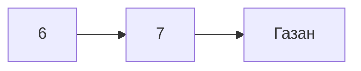

# Типа скрипт лекции по markdown и описание презентации 
 
---
 
| Блок | 
|---|
| 1. Вступление и завязка |
| 2. Что такое Markdown и с чем его едят|
| 3. История и факты |
| 4. Синтаксис: заголовки, текст, списки |
| 5. Ссылки и картинки |
| 6. Код, таблицы, цитаты |
| 8. Собираем настоящий README |
| 9. Блок про расширения |
| 10. mkdocs |
| 11. Инструменты |

---
**Слайд 1 - «Markdown.**
Вступительный слайд

**Слайд 2 - «Серая стена» vs Markdown.**
 
два варианта одного текста: слева - сплошняк , справа - оформленный. Какой лучше ? :/ Ответ очевиден - это и есть тема на весь урок.
 
---

## Что такое Markdown и с чем его едят
 
«Markdown - это язык разметки, с помощью которого можно писать документы в любом текстовом редакторе и открывать его вообще везде, хоть nano, хоть vscode, markdown откроется где угодно. Там нет никаких проблем с форматированием, потому что он от тебя ничего не скрывает - Всё форматирование задаётся, с помощью так называемых тэгов в тексте - никаких невидимых секретов под капотом (Как в случае с MS word ). Никаких - таблица съехала, потому что ты случайно зажал Ctrl :) и главное - всё стабильно. Markdown спокойно приплетается на сайты, блог, документацию, презентацию - куда угодно. Пишешь текст и на изи можешь конвертнуть его в любой формат. Без обязательного визуального редактора, без выпадающих меню на пол экрана и теде.

 Не просто так все нормальные проекты давно на маркдауне сидят - вся документация, почти весь опенсорс, нормальные блоги - всё через маркдаун. Почему - да потому что он **просто** работает. Неудивительно, что продукт изначально созданный программистами для программистовв оказывается лучше всяких офисных штук сделанных для нормисов с красивым gui, бесконечными кнопками и списками

Тут же можно провести аналогию с  windows и линукс. В винде чтоб что-то сделать нужно надорваться в user-friendy UX, который постоянно меняется и ломается, а в линуксе ты можешь спокойно открыть терминал и по инструкции 10-летней давности Сделать ВСЁ - за пару комманд  
Три шага (на слайде): **печатаешь символы → программа их читает → получаешь красоту.**

## История и факты
 
Маркдаун появился в 2004, и придумали его Джон Грубер и Аарон Шварц - чувак, что приложил руку к Reddit и RSS. Ребята не стали городить очередной монструозный формат с тоннами тегов и менюшек - наоборот, сделали максимально просто. Идея была почти гениальная в своей лени: писать текст так, чтобы его было приятно читать прямо в исходнике, без рендера. Чтоб черновик и готовый результат выглядели почти одинаково - открыл .md хоть в блокноте, и всё понятно.

на гитхабе первое, что видишь в любом проекте, - это README.md на маркдауне. По сути это «лицо» репозитория, и оно на маркдауне не просто так.

 
**Слайд 4 - Где живёт Markdown.**
**Где его могли видеть - а скорее всего, и пользоваться.** Места, которые почти все знают: **GitHub, Discord, Reddit, Telegram, Notion, Obsidian.**
 
**Главный поинт:** ты уже писал на Markdown и сам того не знал. Набирал в Discord `**текст**`, чтобы выделить жирным? Это он. Оформлял сообщение в Telegram? Снова он. Markdown повсюду - и работает настолько незаметно, что ты его даже не замечаешь. А это, если подумать, прямое следствие того, с чего мы начали: когда инструмент простой и не подводит, его тихо встраивают везде.

**Почему именно он, а не своя разметка у каждого.** Любому сервису проще взять готовый, всем понятный стандарт, чем изобретать велосипед. Markdown этим стандартом и стал - потому что ОЧЕНЬ простой и открытый
 
---
 
## Блок 4. Базовый синтаксис
 
каждый элемент показываем в формате **«ты пишешь» → «видишь»**. Слева - сырой текст с символами, справа - результат.
 
### Слайд 5 - Базовый принцип
 
Якорный слайд. Идея: «во всём Markdown работает один принцип - **символ-обёртка**. Ты оборачиваешь текст определёнными символами, и он меняет вид.
 
### Слайд 6 - Заголовки (H1–H3)
 
```
# Большой заголовок
## Поменьше
### Ещё меньше
```
 
Объяснение:
 
«Решётка `#` - это заголовок. Одна решётка - самый большой, как название главы. Две - подзаголовок. Три - ещё мельче. Чем больше решёток, тем мельче текст. **Главное - пробел после решётки!** Без пробела не сработает.»
 
### Слайд 7 - Жирный, курсив, зачёркнутый
 

**жирный**        → жирный
*курсив*          → курсив
~~зачёркнутый~~   → зачёркнутый
***жирный курсив*** → и то и другое сразу
 
Лайфхак для запоминания (он на слайде):
 
«Жирный - **две** звёздочки с каждой стороны. Курсив - **одна**. Зачёркнутый - две тильды `~~`. Зачёркнутый удобен для шуток: ~~было 100р~~ стало 50р.»
 
 «**Не спамить!**»
 анонс: «Стрим ~~завтра~~ **сегодня** в 19:00».
 
### Слайд 8 - Списки
 
```
Маркированный:        Нумерованный:
- молоко              1. Рождение
- хлеб                2. установка arch
- кот                 3. Смерть
```
 
«Маркированный список - ставишь **дефис и пробел** в начале строки. Нумерованный - **цифру, точку и пробел**. Прикол: для нумерованного можешь хоть везде писать `1.` - Markdown сам посчитает по порядку.»
 
---
 
## Ссылки и картинки
 
```
[текст ссылки](https://youtube.com)

```
 
Объяснение:
 
«Ссылка: в **квадратных** скобках - текст, который видно, в **круглых** - куда ведёт. `[мой канал](ссылка)`.
Картинка - то же самое, но впереди ставишь **восклицательный знак** `!`

 
---
 
> 💡Тут можно какой-то интерактив вставить, потому что про опловину синтаксиса уже рассказали .
 
---
 
##  Код, таблицы, цитаты 
 
### Слайд  - Код
 
Два вида:
 
```
Инлайн (внутри строки):
Нажми `Ctrl + C`, чтобы скопировать.
 
Блок (многострочный):
` ` `
print("I use arch btw!")
` ` `
```
*(в реальности - три обратных апострофа ``` без пробелов)*
«Одинарными обратными кавычками `` ` `` оборачиваешь **код внутри предложения** - название клавиши, команду, имя файла. Тремя - **целый блок кода**, он встанет в рамочку моноширинным шрифтом.

> Пример: показать команду запуска бота, строчку кода, путь к файлу.

 
###  - Таблицы
 
```
| Игра      | Оценка |
|-----------|--------|
| заглушка  | 10/10  |
| заглушка | 8/10   |
```
 
«Колонки разделяешь палочкой `|`. **Вторая строка из дефисов** - это "шапка", она отделяет заголовки от данных. Не обязательно ровнять палочки идеально - Markdown сам выровняет. Главное, чтобы вторая строка была из дефисов.»
 
###  - Цитаты
 
```
> Это цитата.
```
> Интеллект - это способность избежать выполнения работы, но, тем не менее, сделать так, чтобы она была выполнена. © линус торвальдс.


«Знак "больше" `>` в начале строки делает **цитату** - текст с полоской слева. Удобно для важных мыслей, правил, чужих слов. На форумах, в телеграмм и реддит так оформляют ответ на сообщение.»
 
---
 
## Собираем настоящий README
 
Кульминация: показываем, как **всё вместе** превращается в настоящий `README.md` - как у реальных проектов на GitHub. На слайде - пример описания телеграмм/max-бота  со всеми элементами сразу: заголовок, описание, список команд, блок кода с установкой.
 
«Вот так выглядит "прод" - реальный документ, который вы встретите в любом проекте. Заголовок проекта, краткое описание, список фич, как установить (блок кода), как пользоваться. Всё, что о чем рассказывали - здесь. Вы только что научились читать и писать то, на чём держится вся документация, GitHub, и опенсорс.»
 
> 💡 Тут можно открыть реальную документацию популярного проекта».

---

## Блок про расширения · 
Markdown - это не потолок. Голый Markdown - это база, а не предел. Заголовки, списки, ссылки - и на этом официально всё. Но людям захотелось большего, не вылезая из простого текста. Так появились расширения - надстройки, которые добавляют возможности, не ломая главный принцип: пишешь символами - получаешь результат.
GFM (GitHub Flavored Markdown) - фактически расширенный стандарт, на котором сидит гитхаб. Докинул того, чего в оригинале не было: таблицы (те самые палочки |), чек-листы - [ ] / - [x] с реальными кликабельными галочками, подсветку кода (пишешь ```python - и код раскрашивается сам), эмодзи :fire:, зачёркивание, автоссылки. По сути это маркдаун «как все привыкли».

Mermaid - тут уже начинается магия. Ты пишешь текстом описание схемы - а на выходе получаешь нарисованную диаграмму. Не открываешь Visio, не двигаешь стрелочки мышкой три часа - просто описываешь связи словами:

И эта штука сама рисует блок-схему. Так же делаются диаграммы последовательности, гант-чарты, графы, ER-диаграммы баз данных. Поменялась логика - поправил строчку текста, схема перерисовалась сама. Никакого «перетащи сорок квадратиков заново». GitHub, Notion, Obsidian - везде поддерживают из коробки.Ну и по мелочи: математические формулы через LaTeX 

$$\left( \sum_{k=1}^n a_k b_k \right)^2 \leq \left( \sum_{k=1}^n a_k^2 \right) \left( \sum_{k=1}^n b_k^2 \right)$$

, сноски, и так далее. Под любую задачу есть надстройка.Главное держать в голове: всё это по-прежнему обычный текстовый файл. Открыл в блокноте - всё читается. Расширения не ломают идею простоты, они её докручивают. Так же для всяких навороченных штук можно использовать html и css теги.

## MkDocs · из папки с .md - в сайт
Из маркдауна Можно собрать не только один документ, а целый сайт. Для этого есть MkDocs (и его прокачанная тема Material for MkDocs).
Идея простая до неприличия: ты пишешь обычные .md файлы, а MkDocs превращает их в полноценный сайт-документацию - с навигацией, поиском, тёмной темой и мобильной версией. Ты не трогаешь ни строчки HTML или CSS, занимаешься только текстом - остальное он делает за тебя.
Как это работает по сути:

Кидаешь свои .md в папку.
Пишешь маленький конфиг (тоже простой текст - mkdocs.yml).
Команда mkdocs serve - и у тебя локально крутится готовый сайт с живым обновлением: правишь текст - страница сама перезагружается.
mkdocs build и деплой - и он в интернете.

Почему это красиво - это ровно тот же принцип, только на максималках: простота и структурированность. Контент отдельно (твой простой текст), оформление отдельно (тема сделает красиво). Меняешь текст - сайт обновляется. Никаких CMS-комбайнов, визуальных конструкторов и «ой, шаблон поехал». Просто текст готовый продукт.

> КРУТОЙ ПРИМЕР (ОФИЦИАЛЬНАЯ ДОКУМЕНТАЦИЯ mkdocs-material) : https://squidfunk.github.io/mkdocs-material/
МОЖНО ДАЖЕ ПОБРОДИТЬ ПО GITHUB ИСХОДНИКАМ И ПОСМОТРЕТЬ КАК ЭТО ВСЁ СДЕЛАНО.

##  Инструменты и практика 
 
**Слайд 16 - Где писать**
 
- **dillinger.io** - слева пишешь, справа сразу видишь результат. Ничего ставить не надо.
- **stackedit.io** - то же самое, чуть больше возможностей.
- **markdownlivepreview.com** - самый простой, открыл и пишешь.
> Ну и большинство текстовых редакторов / движков - vscode с расширением на превью md например
