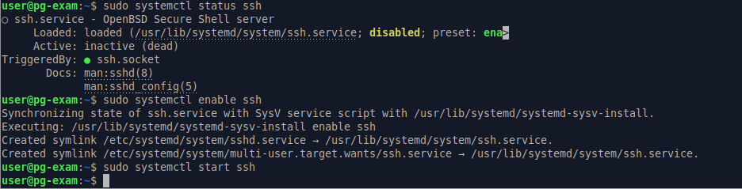
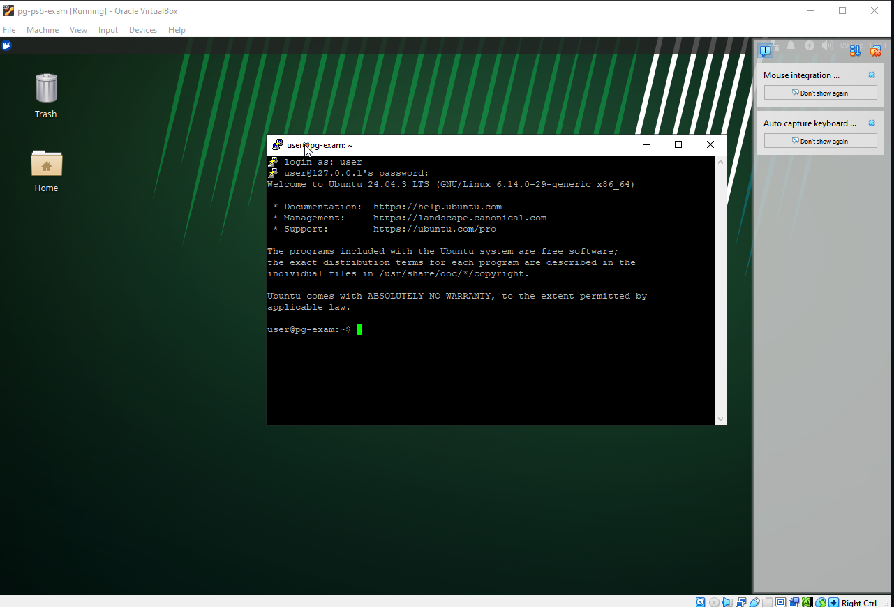

# Подготовка VM 
Виртуальная машина была импортирована из образа, порт 22 проброшен (localhost, TCP)
Изначально на VM отсутствовал SSH-сервер. Установил его, включил 

После включения на vm SSH-сервера, для проверки доступности сервера подключился к машине ssh клиентом PUTTY.

Все дальнейшие действия будут выполняться, используя WSL.

Удалил задание крон
```bash
sudo crontab -r -u root
```
Добавил репозиторий Яндекса с графаной
```bash
echo "deb [trusted=yes] http://mirror.yandex.ru/mirrors/packages.grafana.com/oss/deb stable main" | sudo tee /etc/apt/sources.list.d/grafana.list

```


# ПРАКТИЧЕСКАЯ ЭКЗАМЕНАЦИОННАЯ РАБОТА

## Подготовка Окружения

Для выполнения практической работы использовался **WSL** (1 Версии). Выбор был сделан потому, что я решил выполнять задание средствами Ansible, а WSL, стал простым решением для запуска из него плейбуков + 1 версия разделяет сетевой интерфейс с основной windows, которую я так же задействовал в решении задач;

Для написания ansible playbook использовался Visual studio code установленный на хостовой машине windows. Было установлено расширение **Remote Development**, что позволило открывать рабочую папку `ansible-exam`, расположенную в wsl и редактировать напрямую файлы в linux среде.

Дополнительно поверх **Remote Development** были установлены расширения ansible и его зависимости для совместимости vscode с ansible и .yaml. В wsl-среде был установлен пакет `ansible-lint`, который синхронизировался с vscode ansible.

Все эти решения позволили мне работать в комфортной среде, а так же выполнять проверку синтаксиса и стандартов написания и избегать ошибок в реальном времени 🤓

```shell
# Расширения vscode (Windows)
C:\Users\jammbeast>code --list-extensions > vscode-extensions.txt
```
```txt
eamodio.gitlens
esbenp.prettier-vscode
github.copilot
github.copilot-chat
golang.go
ms-azuretools.vscode-containers
ms-azuretools.vscode-docker
ms-python.debugpy
ms-python.python
ms-python.vscode-pylance
ms-python.vscode-python-envs
ms-toolsai.jupyter
ms-toolsai.jupyter-keymap
ms-toolsai.jupyter-renderers
ms-toolsai.vscode-jupyter-cell-tags
ms-toolsai.vscode-jupyter-slideshow
ms-vscode-remote.remote-containers
ms-vscode-remote.remote-ssh
ms-vscode-remote.remote-ssh-edit
ms-vscode-remote.remote-wsl
ms-vscode-remote.vscode-remote-extensionpack
ms-vscode.remote-explorer
ms-vscode.remote-server
redhat.ansible
redhat.vscode-yaml

```
```shell
#Расширения vscode (WSL) 
--list-extensions > vscode-extensions.txt
``` 
```txt
Extensions installed on WSL: Ubuntu:
github.copilot
github.copilot-chat
ms-python.debugpy
ms-python.python
ms-python.vscode-pylance
ms-python.vscode-python-envs
redhat.ansible
redhat.vscode-yaml
```

## Выполнение заданий.
### Задание 1

Сначала был написан [[Отчет Зарипов Ренат#ansible.cfg | конфиг]] в котором указал основные параметры для работы ansible.
На протяжении всей работы использовалась официальная ([документация ansible](https://docs.ansible.com/ansible/latest/))
Указал файл инвентаря, отключил проверку ssh ключей. Указал пользователя и оптимизационные параметры.

Далее написал [[Отчет Зарипов Ренат#inventory.yaml| inventory.yaml]], где указал по какому адресу / порту подключаться, какого использовать пользователя и создал группу monitoring, в которую включен хост с которым мы будем работать.
Пропинговал хосты:
```bash
ansible all -m ping
```


**Приступил к написанию task1.yaml.** 

Все действия в этом плейбуке выполняются из под Рута.
Для каждой задачи использовал встроенные модули `ansible.builtin` (Кроме `community.general.timezone`). В первом задании для проверок выполнения действий регистрировал переменные результатов выполнения (True/False), доступные только в этом плейбуке `register:`, для дальнейшего вывода результатов в блоках дебага.
* Установил hostname monitoring-server.local командой hostname, а так же отредактировал его значение в /etc/hosts.
* Проверил и обновил информацию о пакетах с помощью `update_cache: true`
* Установил временную зону "europe/Moscow"
* В проверочных блоках, используя модуль `command` проходился по каждому пункту и так же регистрировал переменные, с соответствующими данными.
* В конце используя, ранее зарегестрированные переменные, вывел системную информацию, где указаны: хосты, время, информация о пакетах
* P.S Т.к это не первый запуск плейбука результаты изменения: `False`


### Задание 2
В ходе выполнения этого задания, я обращался к оф. документации прометея, графаны и ansible, Включая официальные страницы прометея и графаны github, в основном для правильного редактирования / создания сервисов и конфигов, чтобы соответствовать требованиям Т.З касательно рабочих директорий, работы из под своего пользователя и ограничений хранилища.

#### Ход работы:
Вся работа выполнялась по принципу: Планирование - Анализ - Реализация.

Сначала прописал задание, которое устанавливает необходимые пакеты: `grafana`, `prometheus`, `tar` (для работы модуля `unarchive`)


Далее я проанализировал, какие переменные мне могут понадобится, а именно:
Имена пользователей, порты, и переменная рабочей директории `/srv`.
Также Когда я начал конфигурировать grafana, добавил переменные для входа в grafanalabs


**Создаем пользователей под каждый из сервисов**. Указываем, что это системные пользователи и ограничиваем взаимодействие с ними.


В ходе анализа документации, стандартных `.service` файлов выявил, какие директории нужны каждому из сервисов: `/data` для хранения метрик прометеем.
`/logs,` `/data,` `/plugins` для Графаны и  `/dashboards` куда в последствие будет скачан .json дэшборд.
Все эти директории были созданы в рабочем каталоге /srv и выданы соответсвующие права пользователям (владельцам) их рабочих директорий
==0755 = rwxr-xr-x==


Создал задания, которые устанавливают node-exporter путем скачивания последней версии с github репозитория, распаковки в /tmp и копирования бинарных файлов в `/usr/local/bin/node_exporter`. Так же выданы права 0755 для пользователя node и он же назначен владельцем директории


**В ходе работы на "контрольных точках" я прогонял playbook и смотрел на удаленном сервере поднимаются ли сервисы.**

Далее был написан сервис node-exporter В целом, он практически стандартный за исключением опции --web.listen-address=, который я использовал, чтобы указать порт


Здесь я заметил, что мой сервис node-exporter падает.
```bash
journalctl -u node-exporter
```
Показал, что сервис не может пробиться в 9100 порт.
```bash
sudo ss -tlnp | grep :9100 
```
Определил, что 9100 порт занят `prometheus-node-exporter`, который подтянулся при установке `prometheus` и занял 9100 порт. Прописал задания для удаления это пакета и остановки его сервиса. 


Теперь Команды
```bash
curl -s localhost:9100/metrics | head -n 10
```
```bash
systemctl status node-exporter
```
```bash
ps aux | grep node-exporter
```
Показали, что node exporter работает, да и еще из под `nodeusr` и собирает метрики


Далее занялся прописыванием скрейп конфига прометея, а именно добавлением туда node_exporter job


##### кастомный сервис `prometheus-custom`
Тут мне пришлось обратится к документации [prometheus](https://prometheus.io/docs/prometheus/latest/storage/), чтобы правильно прописать опции `--storage` запуска сервиса: указать путь хранения данных `tsdb.path`, ограничения хранилища `tsdb.retention.size` и `tsdb.retention.time`, а так же указать порт. 


* Т.к это кастомный сервис. То для корректной работы в начале playbook-а прописал задание на остановку стандартных сервисов


Проверка работоспособности связки node-exporter + prometheus 
```bash
curl -s 'http://localhost:9090/api/v1/query?query=up'
```
```bash
systemctl show prometheus-custom.service -p User
```


Вывод: прометей собирает метрики node-exporter. А так же процесс работает от имени `prometheususr`.

##### Работа с Графаной
Изучив стандартный `.service` файл графаны я увидел, что там много строк, особенно отведенных под безопасность.
Было решено не создавать новый `.service`, а перетереть стандартный, где я просто явно укажу, что процесс должен работать из под grafanausr.

Тут я столкнулся с тем, что пакетная графана не хотела запускаться, из-за того что
* во-первых: ожидает запуска из каталога с статичными файлами, а учитывая что у меня нестандартный пользователь, она не могла найти ресурсы в `/usr/share/grafana`. 
* во-вторых: не могла прочитать и писать  системные каталоги `/etc/grafana` (Как раз место где лежит конфиг графаны) и `/var/* /grafana`. Даже при учете того, что я перенаправил логи в `/srv` первый старт до чтения нового `grafana.ini` мог обратится к старым путям. 
В связи с этим мне пришлось:
* Передать владение системными каталогами пользователю grafanausr
* А также Указать в override `grafana.service`  _WorkingDirectory=/usr/share/grafana_
Изменяемые данные при этом всё так же будут хранится и писаться в `/srv/grafanausr`

P.S Я выявил это используя journalctl -u grafana-server. Скриншота не будет (я не сделал его).😔😔😔


Далее я настроил `grafana.ini`, Где установил рабочие директории для логов, данных, плагинов, указал порт. А так же установил стандартные логин/пароль.
А так же явно указал место (стандартное, которое создалось пакетной графаной) где должны лежать конфиги  (Дэшборды_нейм.json и источник_данных_нейм .yaml). И т.к Графана только читает, но не пишет в эту папку её нет смысла переносить в `/srv/` 


Теперь графана-сервер запускается и работает без ошибок из под нашего нестандартного пользователя.


Далее скачал node-exporter.json (dashboard) с grafanalabs в `/srv/grafanausr/dashboards`


Далее посмотрел стандартный sample.yaml в "/etc/grafana/provisioning/dashboards
```yaml # # config file version
apiVersion: 1

#providers:
# - name: 'default'
#   orgId: 1
#   folder: ''
#   folderUid: ''
#   type: file
#   options:
#     path: /var/lib/grafana/dashboards
```
И по его подобию создал dashboards.yaml и добавил туда скачанный dashboard node exporter (Указал название и путь к файлу)


Сделал тоже самое только для datasource ( в `sample.yaml` datasource посмотрел какие используются модули, за что они отвечают и собрал свой `prometheus.yaml`)
acess: proxy указан, чтобы запросы шли с бэкэнд сервера графаны, а не напрямую с браузера 


Ну и так же прописана задача, которая включает все сервисы, после настройки и конфигураций (Чтобы точно привести все сервисы в состояние enabled + running). А также прописаны спец. задачи перезапусков `systemd` и сервисов, которые вызываются по директиве `notify:`


#### Результат прохода ansible playbook


#### Проверка.
Т.к на Виртуальной машине нет браузера, чтобы зайти на Localhost:3000, я пробросил 3000 порт наружу (На мою windows-машину)
```bash
ssh -L 3000:localhost:3000 user@localhost -p 22
``` 
Открыл в браузере localhost:3000

